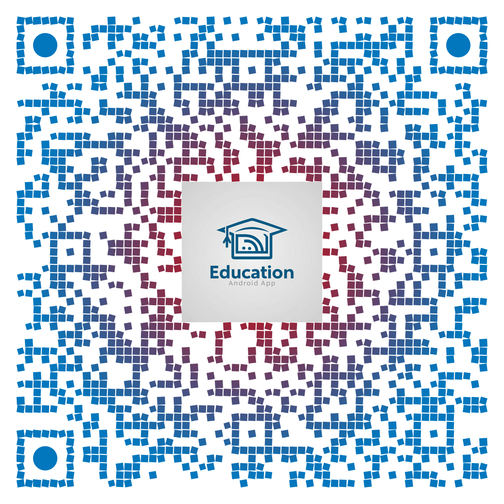

# 🎓 **EduApp - Learning & Teaching Platform** 📚

**EduApp** is a comprehensive educational platform designed for both students and teachers, with admin control features. Similar to platforms like Udemy, users can register as teachers, students, or admins. Teachers can upload courses, create quizzes, and students can enroll in courses and take quizzes. This app supports in-app video playback and notifications.

---

## 🔑 Key Features

### 👩‍🏫 **User Roles**:
- **Student**: Browse, enroll in courses, take quizzes, and view results.
- **Teacher**: Upload courses, create quizzes (MCQs with or without images), manage students.
- **Admin**: Manage users, courses, and overall app settings.

### 📁 **Course Management**:
- Teachers can upload courses and materials (including lessons and quizzes).
- Courses include lessons with YouTube videos (using YouTube Video IDs).
- Students can view lessons, watch videos, and complete quizzes.

### 📝 **Quiz Creation**:
- Teachers can create quizzes (MCQs) with optional image support.
- Students can take quizzes, and their results are automatically saved.

### 🔥 **Firebase Integration**:
- **Authentication**: Secure user sign-up and login with Firebase.
- **Cloud Firestore**: Efficiently store course details, user information, and quiz results.
- **Firebase Cloud Messaging (FCM)**: Send real-time push notifications.

### 📢 **Push Notifications**:
- Implemented using **OneSignal** and **Firebase Cloud Messaging (FCM)**.
- Stay updated with course additions, quiz results, and more.

### 🎥 **Video Playback**:
- Lessons include videos fetched directly from YouTube using a **YouTube Video ID**.
- Smooth in-app video playback experience.

---

## 🛠 **Technology Stack**

| Technology        | Description                                            |
|-------------------|--------------------------------------------------------|
| **Frontend**      | **Java** (for Android Development), **XML** (for UI)   |
| **Backend**       | **Firebase Authentication** (user sign-up/login), **Firestore** (data storage), **FCM** (push notifications) |
| **Notifications** | **OneSignal**, **Firebase Cloud Messaging**            |
| **Video**         | **YouTube API** (for fetching and displaying videos)   |

---

## 📱 **Screenshots / QR Code**

---

## 📥 **Download & Installation**

Click the link below to download the app directly to your Android device:

[**Download EduApp**](https://www.dropbox.com/scl/fi/7g2gp6ekcpgcym83mar7e/Edu_Droid.apk?rlkey=ghvgdcqcqt8lfx4wj3vf7jkem&st=36gu6qzg&dl=0)

Scan the QR code above or click the link to install the app and start exploring!

---

## 🚀 **How to Use**

1. **Signup**: Register as a teacher, student, or admin.
2. **Teacher Dashboard**: Create courses and upload quizzes.
3. **Student Dashboard**: Browse courses, watch lessons, and take quizzes.
4. **Admin Control**: Manage app data, courses, and users (admins only).
5. **Notifications**: Get updates on new courses, quiz results, and other important events.

---

## 🎬 **How to Add YouTube Videos to Lessons**

When creating lessons, provide the **YouTube Video ID** to fetch and display the video inside the app:

- Example: For `https://www.youtube.com/watch?v=abcd1234`, the **YouTube Video ID** is `abcd1234`.
- Enter this ID while creating or editing the lesson.

---

## 🔐 **Security & API Keys**

> **Important**:  
> This repository does not contain the source code to protect API keys and sensitive data. All API keys for Firebase and OneSignal are securely stored in the production environment.  
> The app's Firebase configuration is secure and follows standard best practices.

---

## 📧 **Feedback & Support**

Feel free to download and test the app. For any feedback or suggestions, please reach out to us:

- **Email**: lms.app.platform@gmail.com
- **Community Forum**: [EduApp Support](https://community.eduapp.com)

---

Thank you for using **EduApp**! 🎉
